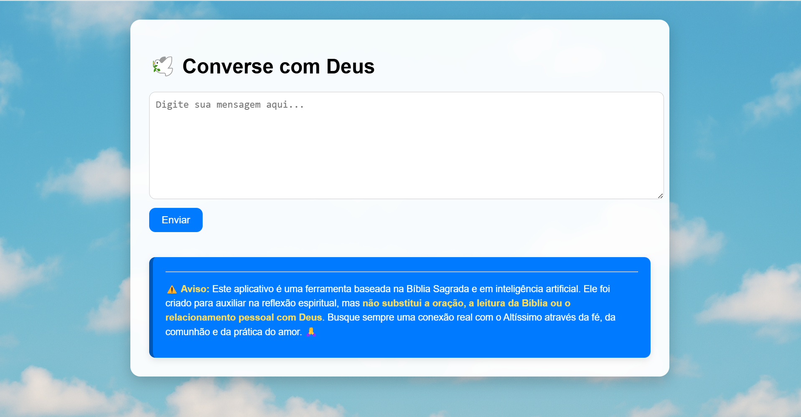

# 🕊️ Voz do Altíssimo – Uma Experiência de Reflexão com Inteligência Artificial

O **Voz do Altíssimo** é um projeto que une tecnologia e espiritualidade de forma respeitosa e inspiradora. Utilizando inteligência artificial e baseando-se na **Bíblia Sagrada**, o sistema responde às mensagens do usuário como se fosse a voz de Deus, promovendo **reflexão espiritual**, **acolhimento** e **crescimento pessoal**.

## ✨ Propósito

Criado com o intuito de ajudar pessoas a encontrarem palavras de sabedoria e consolo, este projeto **não substitui** a oração, a leitura da Bíblia ou o relacionamento com Deus. Ele é uma ferramenta complementar para meditação e busca interior.

---

## ⚙️ Tecnologias Utilizadas

- 🐍 Python
- 📦 Flask
- 🤖 Integração com LLM (Large Language Model) via OpenRouter
- 📜 Leitura e carregamento de textos bíblicos
- 🖼️ HTML + CSS com foco em usabilidade e leveza visual

---

## 📁 Estrutura do Projeto

```
VOZ-DO-ALTISSIMO_WEB/
│
├── data/                # Arquivos auxiliares
├── prompts/             # Prompts usados com IA
├── static/              # Imagens e CSS
├── templates/           # HTML (Flask)
├── ai_response.py       # Lógica de resposta da IA
├── app.py               # Arquivo principal do Flask
├── bible_loader.py      # Carregamento e estruturação bíblica
├── gerar_resposta.py    # Geração da resposta da IA
├── .env                 # Variáveis de ambiente
├── requirements.txt     # Dependências do projeto
└── README.md            # Você está aqui :)
```

---

## 💡 Como Rodar Localmente

1. Clone o repositório:
   ```bash
   git clone https://github.com/seu-usuario/voz-do-altissimo.git
   cd voz-do-altissimo
   ```

2. Crie um ambiente virtual e ative:
   ```bash
   python -m venv venv
   source venv/bin/activate  # Linux/Mac
   venv\Scripts\activate     # Windows
   ```

3. Instale as dependências:
   ```bash
   pip install -r requirements.txt
   ```

4. Adicione seu arquivo `.env` com a chave da API do OpenRouter.

5. Inicie o servidor:
   ```bash
   python app.py
   ```

---

## 🛑 Aviso Importante

> ⚠️ **Este aplicativo é uma ferramenta baseada na Bíblia e em IA.**  
> Ele foi criado para auxiliar na reflexão espiritual, mas **não substitui a oração, a leitura da Bíblia ou o relacionamento pessoal com Deus**.  
> Busque sempre a presença do Altíssimo por meio da fé, comunhão e prática do amor. 🙏

---

## 🙌 Contribuição

Ideias, sugestões ou colaborações são muito bem-vindas!  
Sinta-se à vontade para abrir issues ou pull requests.

---

## 📸 Capturas de Tela

### Tela Inicial:


### Exemplo de Resposta:


---

## 🤝 Conecte-se comigo

Se você curtiu esse projeto, me chama aqui no LinkedIn para conversar:

🔗 [Seu Nome no LinkedIn](https://www.linkedin.com/in/seu-usuario)

---

> _"Se alguém tem falta de sabedoria, peça-a a Deus, que a todos dá livremente..."_ — Tiago 1:5
